## Universidad de San Carlos de Guatemala
## Facultad de ingeniería
## Laboratorio Arquitectura de Computadores y Ensambladores 2
## Sección A
## Auxiliar: Samuel Isaí Muñoz Pereira

### PROYECTO # 1

### Park-Guard

### Integrantes del Grupo
| Nombre | Carnet |
|---|---|
| Kevin David Tobar Barrientos | 202200236 |
| Jacklyn Akasha Cifuentes Ruiz  | 202200236 |
| Daved Abshalon Ejcalon Chonay | 202105668 |
| Isaac Mahanaim Loarca Bautista | 202307546 |
| Raúl Emanuel Yat Cancinos | 202300722 |

## Documentación Técnica
### Objetivos
#### Objetivo General
Desarrollar un sistema automatizado de parqueo denominado Park-Guard, que permita simular la gestión inteligente de espacios, control de acceso vehicular y monitoreo de condiciones ambientales, mediante el uso de un microcontrolador Arduino y diversos sensores y actuadores.

#### Objetivos Específicos
- Implementar un sistema de control de acceso mediante tecnología RFID que valide tarjetas autorizadas para el ingreso al parqueo.

- Controlar el movimiento de dos talanqueras automatizadas mediante servomotores, garantizando una operación suave y secuencial.

- Monitorear en tiempo real la ocupación de al menos cinco espacios de parqueo utilizando sensores de presencia.

- Visualizar en una pantalla LCD información relevante como espacios disponibles, identificación de usuarios y alertas del sistema.

### Alcance
El sistema contará con un mínimo de cinco espacios de parqueo delimitados y numerados. Se implementarán dos talanqueras automáticas: una para ingreso y otra para salida, controladas por servomotores. El ingreso se activará únicamente al detectar una tarjeta RFID válida y si existen espacios disponibles. La salida se activará mediante un botón pulsador. Cada espacio contará con un sensor de presencia (ej. infrarrojo, ultrasónico o final de carrera) para detectar si está libre u ocupado. La pantalla LCD mostrará la cantidad de espacios disponibles,la identificación del usuario al ingresar o salir y mensajes como "Parqueo Lleno" o cosas parecidas. Se incluirá un sensor de gas/humo para monitorear condiciones peligrosas. Ante una emergencia, el sistema deberá detener operaciones normales, activar alarma sonora (buzzer), encender un ventilador mediante un relé, abrir ambas talanqueras automáticamente y mostrar el mensaje de emergencia en la pantalla LCD. Por último, la emergencia tendrá prioridad total mediante interrupciones.

### Descripción del sistema
El sistema Park-Guard es un prototipo funcional a escala que simula la operación de un parqueo vehicular automatizado. Está basado en un microcontrolador Arduino que coordina todos los subsistemas:

- Control de acceso: Utiliza un lector RFID para validar tarjetas autorizadas. Si la tarjeta es válida y hay espacios disponibles, se activa la talanquera de ingreso. En caso contrario, se muestra un mensaje de denegación en la pantalla LCD.

- Monitoreo de espacios: Cada uno de los cinco espacios cuenta con un sensor de presencia. El sistema actualiza constantemente el estado de ocupación y calcula los espacios disponibles.

- Control de talanqueras: Dos servomotores controlan las barreras de ingreso y salida. La talanquera de ingreso se activa con RFID válido; la de salida, con un botón pulsador. Ambas se cierran automáticamente después de un tiempo programado o al detectar que el vehículo ha cruzado.

- Interfaz de usuario: Una pantalla LCD 16x2 muestra en tiempo real la cantidad de espacios disponibles, mensajes de validación de usuarios y alertas del sistema.

- Sistema de seguridad ambiental: Un sensor de gas/humo monitorea continuamente el ambiente. Si se detecta un nivel peligroso (definido por el estudiante), se activa una interrupción que ejecuta el protocolo de emergencia: detiene operaciones, activa alarma, enciende ventilador, abre ambas talanqueras y muestra alerta en LCD.

### Función de cada componente
| Componente | Función en el sistema |
|---|---|
| Arduino Uno | Unidad central de control. Procesa entradas de sensores, ejecuta la lógica del sistema y controla actuadores y pantalla |
| Lector RFID | Lee tarjetas NFC/RFID. Envía el UID de la tarjeta al Arduino para validar si está autorizada |
| Tarjeta RFID | Identificadores únicos para usuarios autorizados. Una para ingreso, otra para salida |
| Servomotor | Actúan como talanqueras automáticas. Abren y cierran las barreras de ingreso y salida |
| Sensor de gas/humo | Monitorea la calidad del aire y detecta concentraciones peligrosas de gas o humo |
| Pantalla LCD | Muestra información visual al usuario: espacios disponibles, mensajes de validación, alertas de emergencia |
| Buzzer | Emite una alerta sonora durante emergencias o accesos inválidos |
| Relé | Activa el ventilador cuando se detecta una emergencia |
| Ventilador | Se enciende automáticamente en emergencias para disipar gases/humo |

## Diagramas del funcionamiento
### Diagrama de bloques
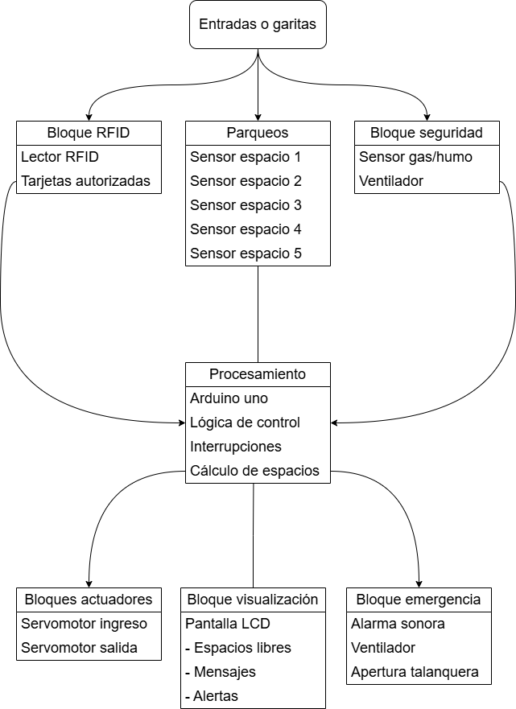
### Diagrama de flujo
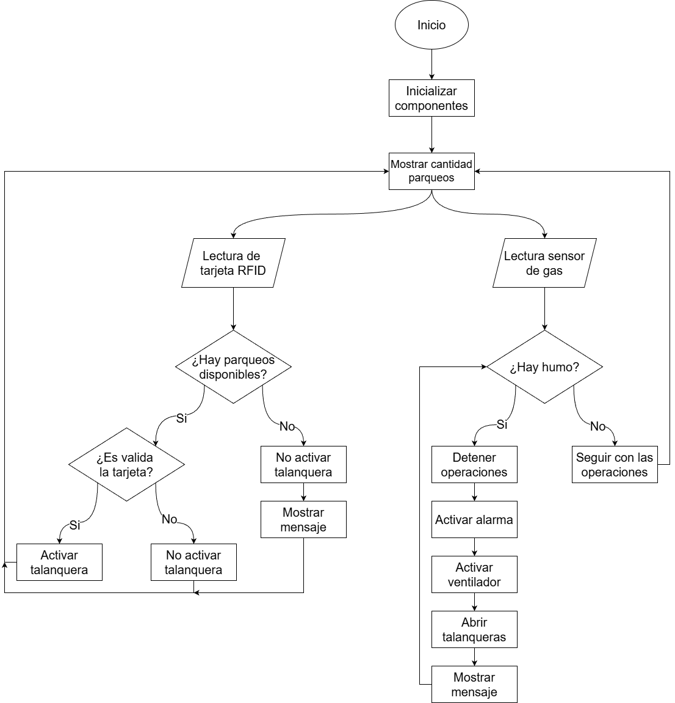

## Bitácora de desarrollo
### Problemas encontrados
1. Nos enfrentamos con el problema de organizarnos para poder juntarnos y de esa manera poder avanzar juntos en el proyecto.

2. Nos enfrentamos con el problema de que el material para el parqueo no resistía bastante el peso tanto de los componentes como de decoraciones.

3. Hubieron problemas que el código no funkaba o que no sabiamos como hacer ciertos procesos como el de las interrupciones o movimiento de las talanqueras.

### Soluciones implementadas
1. Para poder juntarnos, aprovechamos que teniamos entregas de proyectos, parciales y clases en común donde estando en la universidad nos pudimos juntar.

2. Para solucionar lo del material, se compró cartón chip de 80 para poder tener un material resistente donde no se doblara ni descuaranginjara fácilmente.

3. Nos guiamos según el video que nuestro auxiliar grabó y nos compartió donde con ello logramos avanzar en el proyecto. 

## Evidencias fotográficas

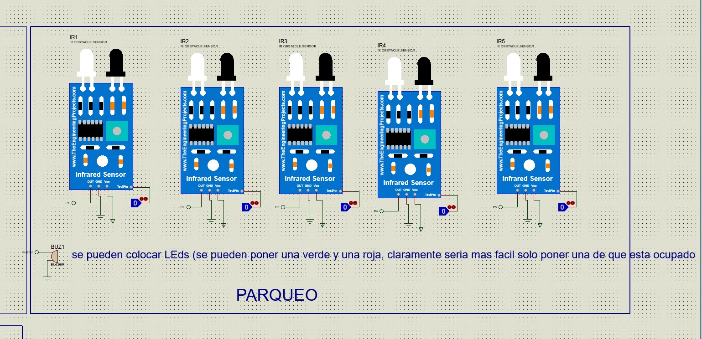
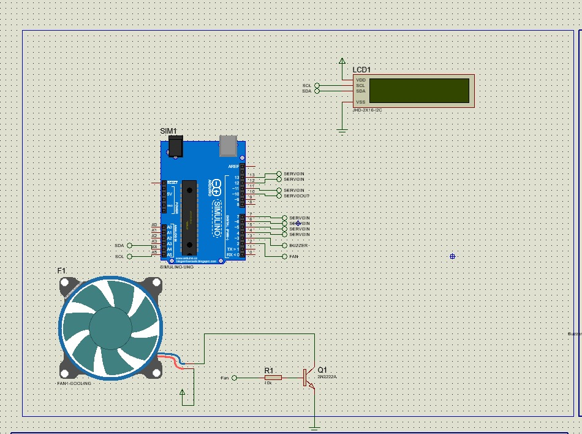
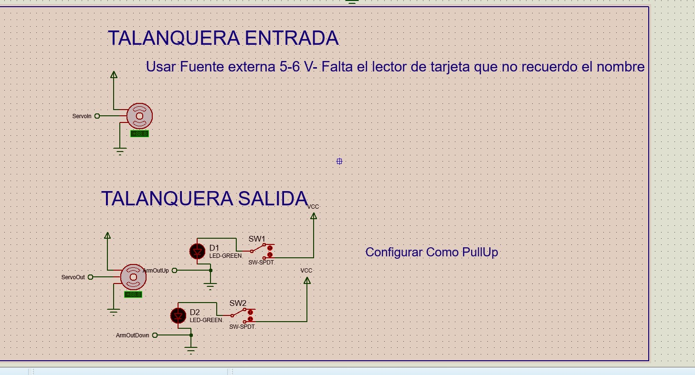
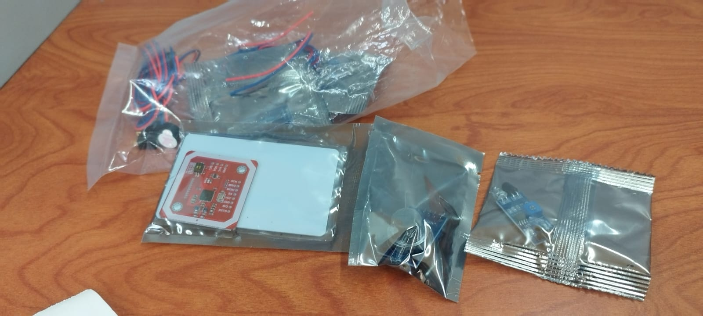
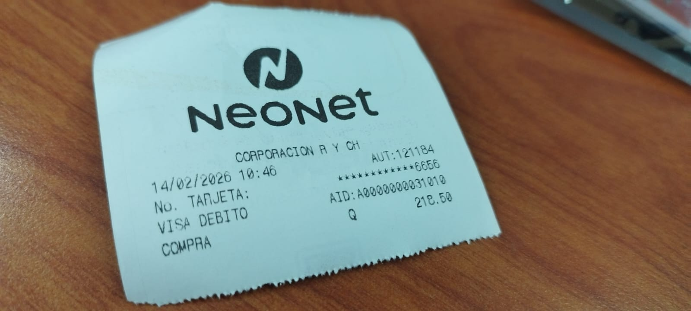
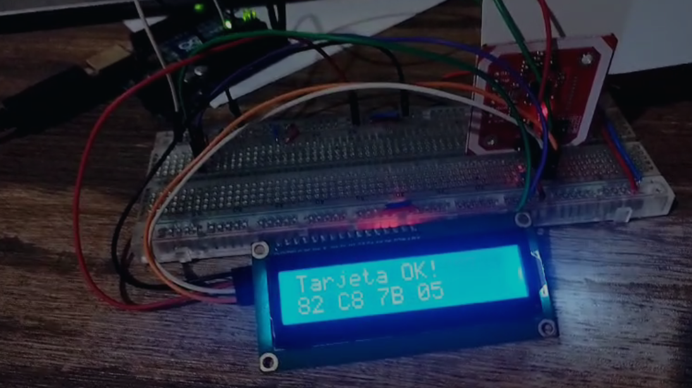
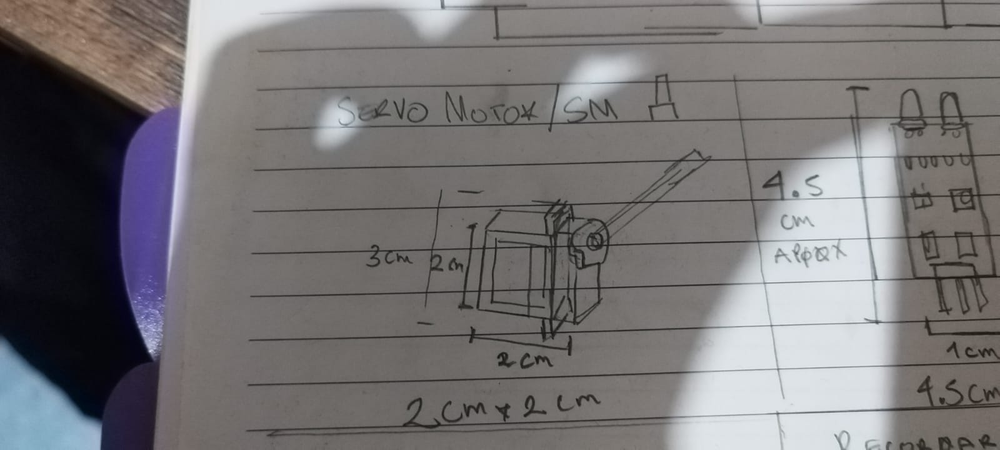
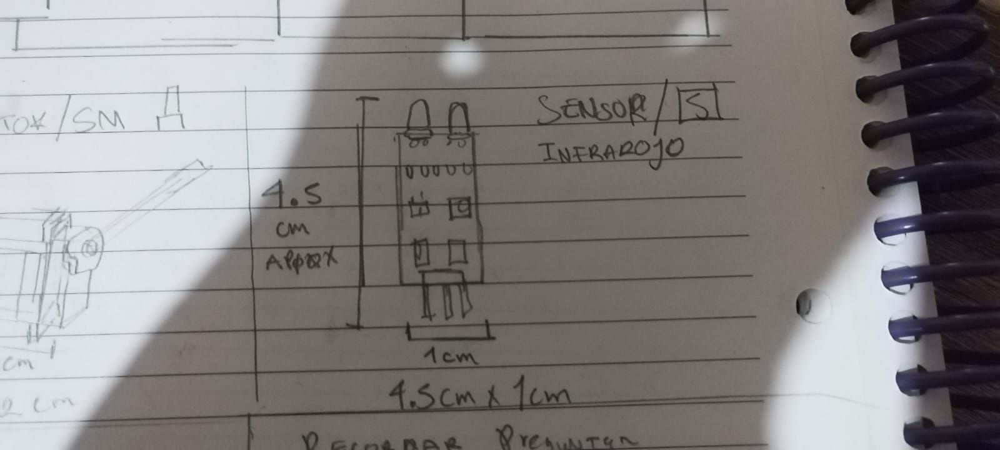
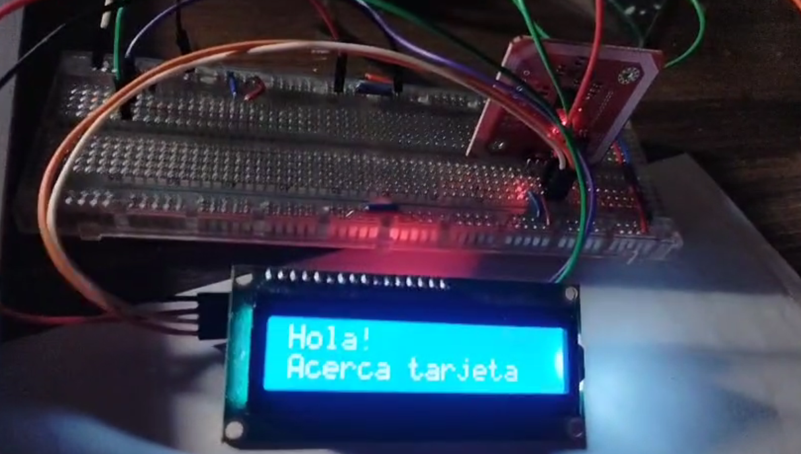
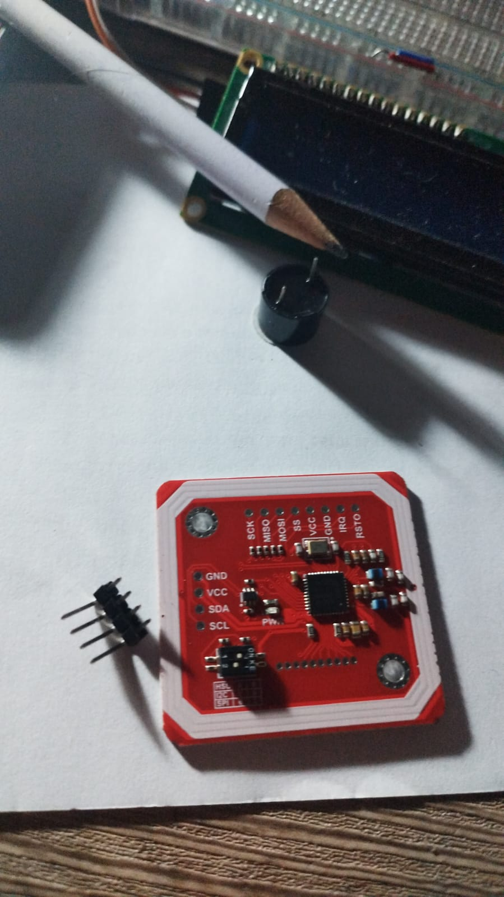
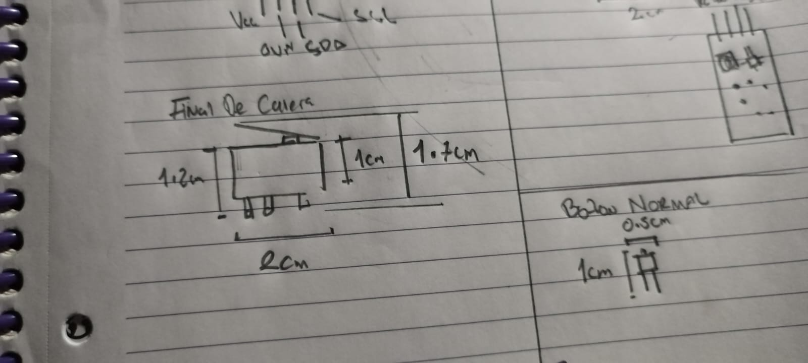
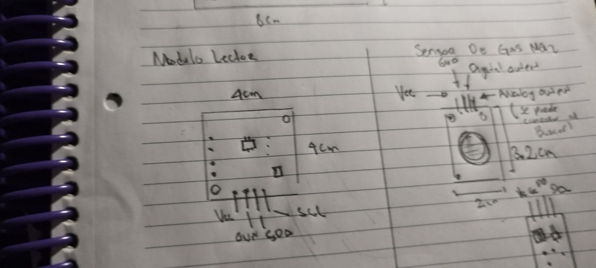
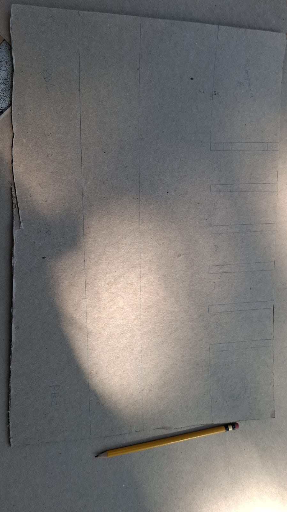
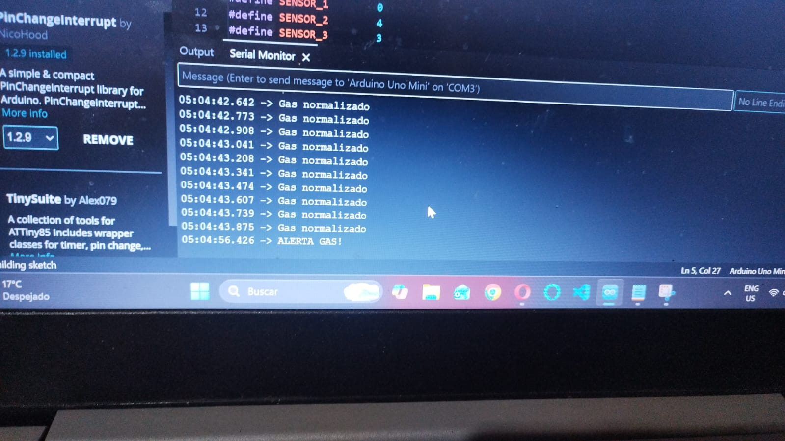
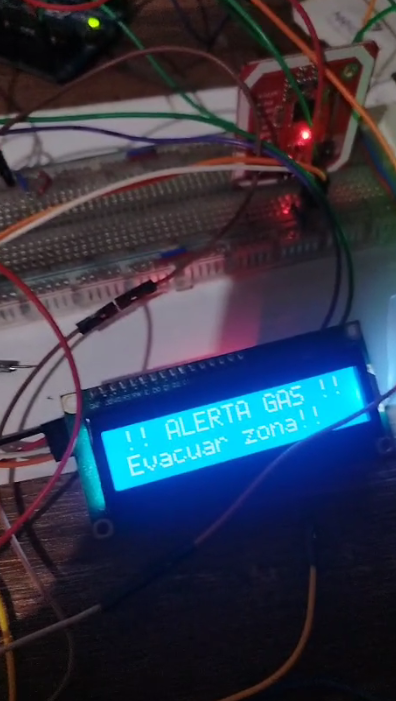
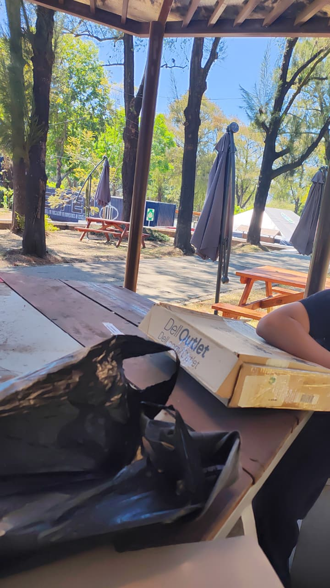