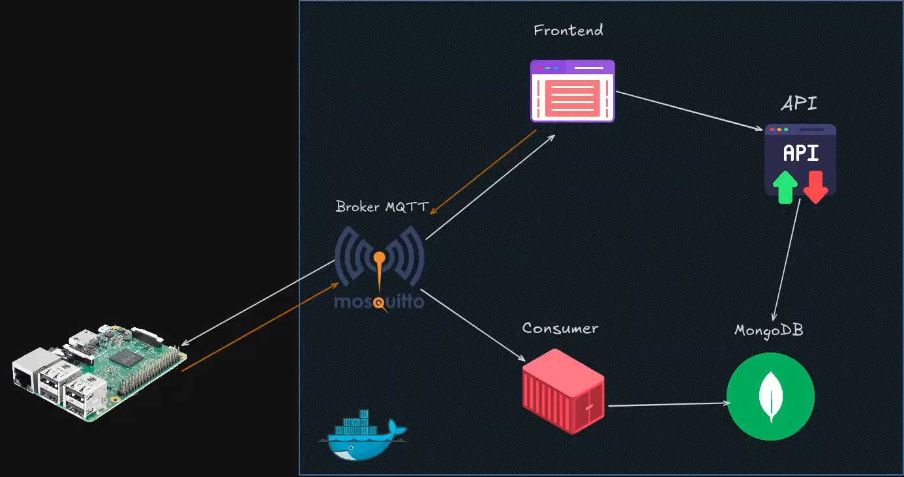
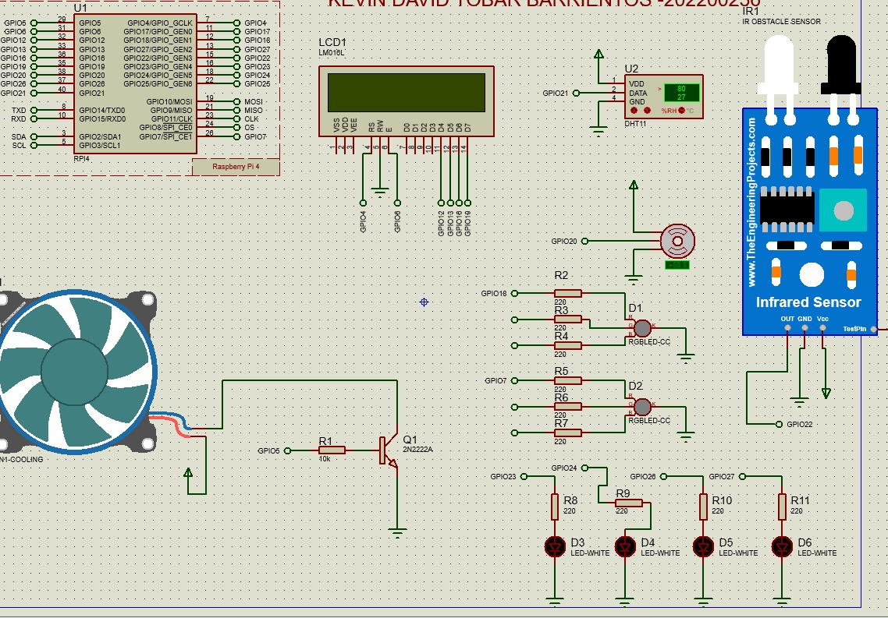
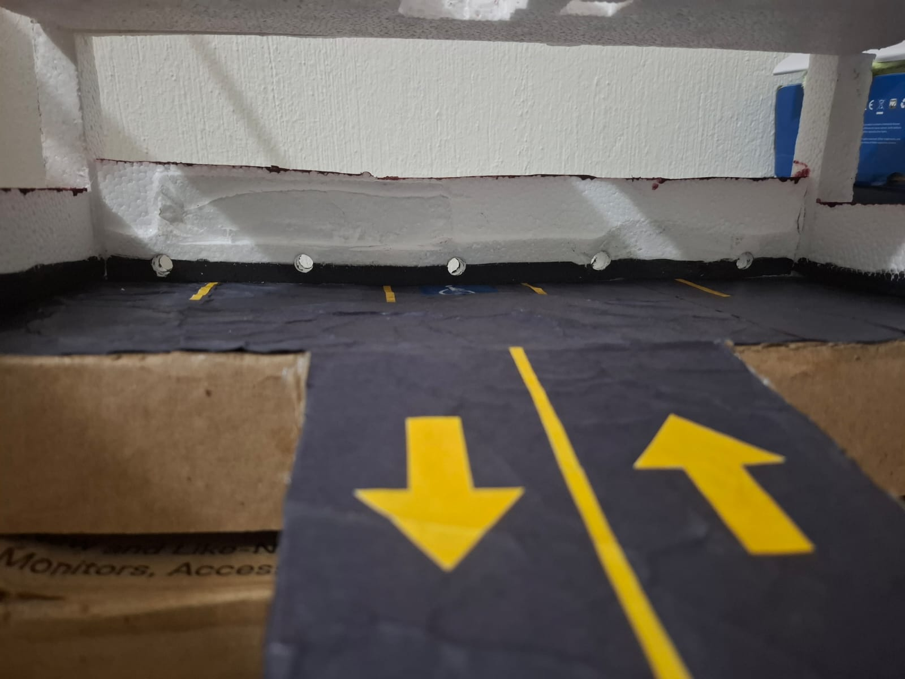
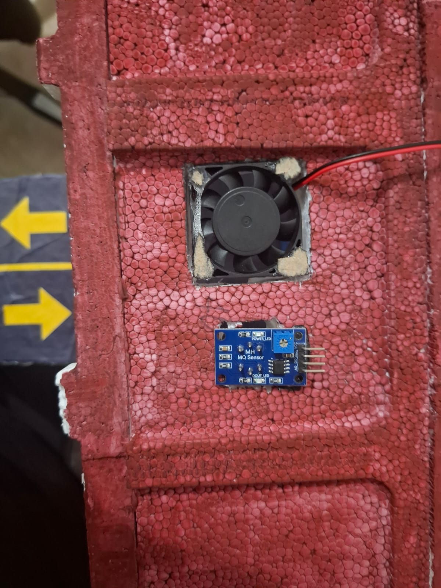
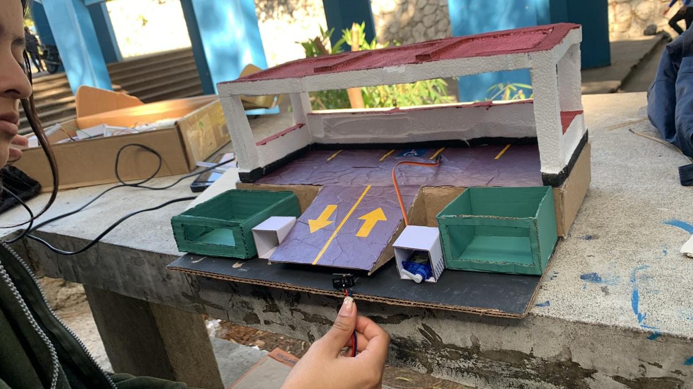
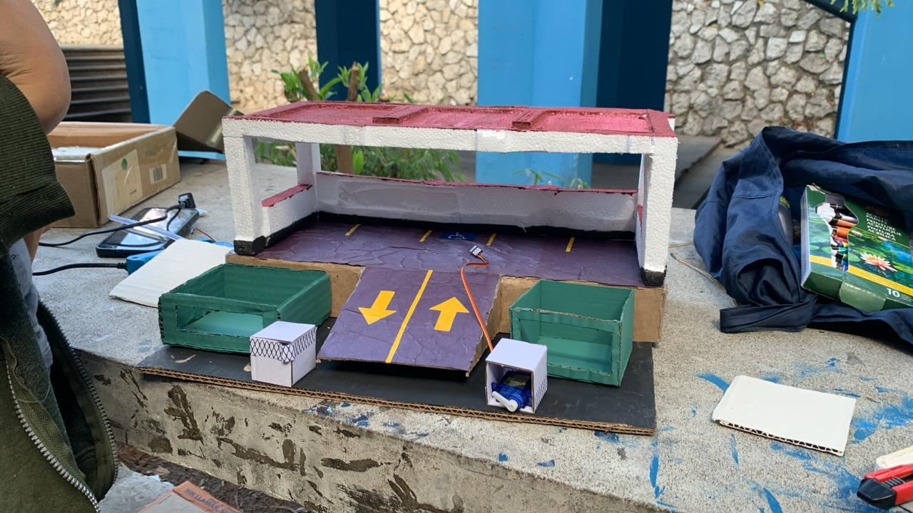
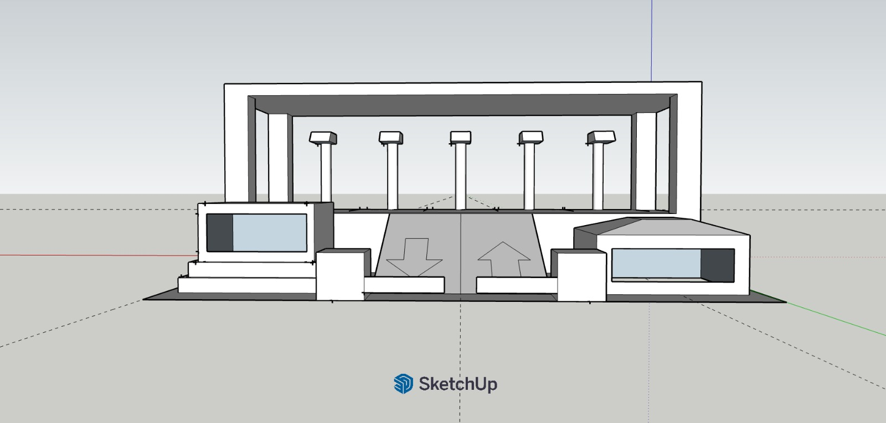

## Universidad de San Carlos de Guatemala
## Facultad de ingeniería
## Laboratorio Arquitectura de Computadores y Ensambladores 2
## Sección A
## Auxiliar: Samuel Isaí Muñoz Pereira


### PROYECTO # 2

### Park-Guard 2.0
### Manual Técnico

### Integrantes del Grupo
| Nombre | Carnet |
|---|---|
| Kevin David Tobar Barrientos | 202200236 |
| Jacklyn Akasha Cifuentes Ruiz  | 202201432 |
| Daved Abshalon Ejcalon Chonay | 202105668 |
| Isaac Mahanaim Loarca Bautista | 202307546 |
| Raúl Emanuel Yat Cancinos | 202300722 |

## Introducción
Se describe la arquitectura, componentes y funcionamiento del sistema Park-Guard 2.0, una evolución del sistema automatizado local hacia una plataforma IoT distribuida basada en contenedores Docker, comunicación MQTT y visualización web en tiempo real.

El sistema integra una maqueta física de parqueo con sensores de ocupación, RFID, sensor de gas y actuadores donde se aplica en talanqueras, ventilador, alarma, entre otros donde junto con una infraestructura backend que incluye un broker MQTT, un consumer en Python, una base de datos NoSQL (MongoDB), una API REST con autenticación JWT y un frontend web desarrollado con React que utiliza P5.js para visualización en tiempo real.

## Objetivos
### Objetivo General
Desarrollar e implementar un sistema IoT distribuido para la gestión inteligente de parqueos, que permita el monitoreo en tiempo real, almacenamiento histórico de eventos, gestión dinámica de usuarios RFID y control remoto mediante una arquitectura basada en MQTT y contenedores Docker.

### Objetivos Específicos
1. Diseñar una arquitectura desacoplada con servicios independientes (broker, consumer, API, base de datos, frontend) comunicados mediante MQTT.

2. Implementar un consumer en Python que procese eventos provenientes de la maqueta física y los almacene en MongoDB.

3. Desarrollar una API REST con autenticación JWT para la gestión de usuarios RFID y consulta de eventos históricos.

4. Contenerizar todos los servicios mediante Docker y publicar las imágenes personalizadas en Docker Hub.

5. Garantizar comunicación bidireccional entre hardware y frontend exclusivamente mediante MQTT.

## Alcance del Proyecto
### Hardware (Maqueta Física)
- 5 espacios de parqueo con sensores de presencia

- 2 talanqueras controladas por servomotores (ingreso y salida)

- Lector RFID (PN532) para autenticación de usuarios

- Sensor de gas/humo (MQ-135 o similar)

- Ventilador controlado por relé

- Alarma sonora (buzzer)

- Pantalla LCD para visualización local

- Raspberry Pi con módulo WiFi para comunicación MQTT

### Infraestructura Backend
- Broker MQTT (Mosquitto) en contenedor Docker

- Consumer Python procesador de eventos (imagen personalizada)

- Base de datos MongoDB (contenedor con persistencia)

- API REST (FastAPI/Flask) con autenticación JWT (imagen personalizada)

### Frontend Web
- Dashboard en tiempo real (actualización vía MQTT WebSockets)

- Dashboard de gestión de usuarios RFID (CRUD completo)

- Dashboard de estadísticas con gráficas

- Generación de reportes PDF descargables

- Activación remota de ventilador, emergencia y gestión de espacios

## Arquitectura del Sistema
### Diagrama de Arquitectura General

Este diagrama de la arquitectura fue brindado por el Auxiliar Samuel Isaí Muñoz Pereira, todos los créditos para él

## Documentación de Topics MQTT

**Prefijo base:** `/parkguard`

| Topic | Descripción |
|---|---|
| `/parkguard/access/request` | Solicitud RFID |
| `/parkguard/access/response` | Respuesta de acceso |
| `/parkguard/occupancy/change` | Cambio de ocupación |
| `/parkguard/emergency/trigger` | Alerta gas/emergencia |
| `/parkguard/emergency/command` | Comando emergencia |
| `/parkguard/exit/request` | Solicitud de salida |
| `/parkguard/exit/command` | Cmd apertura barrera |
| `/parkguard/fan/command` | Control ventilador |
| `/parkguard/space/manage` | Habilitar/deshabilitar |
| `/parkguard/registration/*` | Registro usuarios |
| `/parkguard/users/*` | Gestión usuarios |
| `/parkguard/stats/request` | Solicitud estadísticas |

## Diseño de Base de Datos NoSQL

### Estructura MongoDB

**Base de datos:** `parkguard_db` (5 colecciones)

#### Colecciones

- **users:** nombre, email, rfid, saldo, activo, fecha_creacion  
- **events:** type(access/occupancy/emergency/fan/suspicious/space_maintenance/exit), timestamp, user_id, space_id, details  
- **spaces:** numero, estado(occupied/free), tipo, enabled  
- **logs:** timestamp, level, component, message  
- **statistics:** timestamp, total_entries, occupancy_rate, gas_level

### API REST

#### Configuración General

- **Comunicación:** Vía MQTT  
- **Autenticación:** Bearer Token (JWT)

#### Endpoints por Módulo

**Gestión de Usuarios:**
- GET/POST/PUT/DELETE `/api/users`
- PATCH `/api/users/{id}/toggle`, `/api/users/{id}/balance`

**Consulta de Eventos:**
- GET `/api/events`
- GET `/api/events/{type}`
- GET `/api/events/user/{user_id}`

**Estadísticas:**
- GET `/api/stats/dashboard`
- GET `/api/stats/occupancy`, `/api/stats/revenue`, `/api/stats/export`

**Gestión de Espacios:**
- GET `/api/spaces`, GET `/api/spaces/{space_id}`
- PUT/PATCH `/api/spaces/{space_id}`

## Consumer MQTT

### Descripción General

Servicio Python que procesa eventos MQTT del hardware y gestiona la lógica central del sistema.

### Funcionalidades Principales

#### Procesamiento de Eventos

1. **Validación de acceso RFID:** Consulta MongoDB, descuenta saldo, registra evento
2. **Cambio de ocupación:** Actualiza espacios collection
3. **Emergencia de gas:** Activa alarma, registra evento  
4. **Solicitud de salida:** Abre barrera, libera espacio
5. **Control de ventilador:** Comando manual/automático

#### Gestión de Usuarios

- **Registro de usuarios:** Escaneo RFID → creación en BD
- **CRUD completo:** En collection users

#### Detección de Seguridad

- **Anomalías:** >3 intentos fallidos en 300s → alerta suspicious_activity
## Frontend Web

### Stack Tecnológico

- **Framework:** React 18 + Vite
- **Servidor:** Nginx
- **Comunicación:** MQTT vía WebSocket (puerto 9001)

### Dashboards Disponibles

#### Autenticación
- **Login:** Validación JWT

#### Monitoreo
- **Tiempo Real:** Estado ocupación/gas/ventilador, controles emergencia
- **Estadísticas:** Gráficas ocupación, ingresos/salidas horarias, exportar PDF

#### Administración
- **Usuarios RFID:** Listado, crear, editar, eliminar, buscar

### Arquitectura del Código

**Estructura:** `/src/` organizado en:
- `components/` - Componentes reutilizables
- `context/` - Estado global (AuthContext)
- `hooks/` - Custom hooks (useMQTT)
- `pages/` - Vistas principales
- `services/` - Servicios MQTT/API

### Autenticación

- **Tipo:** Token JWT
- **Almacenamiento:** localStorage
- **Renovación:** Automática antes de expiración

### Comunicación MQTT

**Topics principales suscritos:**
- `/parkguard/access/response`
- `/parkguard/occupancy/change`
- `/parkguard/stats/response`
- Otros eventos del sistema
## Hardware

### Plataforma Central

**Controlador:** Raspberry Pi 4

### Sensores y Entrada

- **RFID:** Lector PN532 (I2C)
- **Ocupación:** 5× sensores de presión (GPIO 23-25, 8, 7)
- **Gas:** Sensor MQ-135
- **Botones:** GPIO 21, 0, 5, 16

### Actuadores y Salida

- **Barreras:** Servos entrada/salida (GPIO 13, 18)
- **Ventilación:** Motor PWM (GPIO 12)
- **Alarma:** Buzzer (GPIO 26)
- **Indicadores:** 5× LEDs (GPIO 17, 27, 22, 10, 11)
- **Pantalla:** LCD 16x2 I2C (dirección 0x27/0x26)

### Buses de Comunicación

**I2C:** SDA-GPIO2, SCL-GPIO3

### Flujos de Operación

#### Acceso (Entrada)
```
RFID → Consumer → Barrera abierta 1s → LED rojo
```

#### Salida (Exit)
```
Botón → Consumer → Barrera abierta → LED verde
```

#### Emergencia (Gas)
```
>400ppm → Buzzer + Ventilador auto + Alerta Frontend
```

#### Registro de Usuarios
```
Modo lectura LCD → Escanear RFID → Usuario creado
```
## Despliegue con Docker

### Arquitectura de Contenedores

**4 servicios principales:**

1. **mosquitto** - Broker MQTT (puertos 1883/9001)
2. **mongodb** - Base de datos NoSQL (puerto 27017)
3. **consumer** - Procesador MQTT (Python)
4. **frontend** - Aplicación web (Nginx)

### Comandos Básicos

#### Iniciar servicios
```bash
docker-compose up -d
```

#### Ver estado
```bash
docker-compose ps
```

#### Ver logs
```bash
docker-compose logs -f [servicio]
```

#### Detener servicios
```bash
docker-compose down
```

### Configuración de Servicios

#### Variables de Entorno

**Consumer:**
- `MQTT_BROKER=mosquitto`
- `MQTT_PORT=1883`
- `MONGO_URI=mongodb://mongodb:27017/`
- `TOPIC_PREFIX=/parkguard`
- `MONGO_DB=parkguard_db`

**Frontend:**
- `REACT_APP_MQTT_BROKER=mosquitto`
- `REACT_APP_MQTT_PORT=9001`

#### Mosquitto (MQTT Broker)

- Allow anonymous clients: `true`
- Listeners: 1883 (TCP) y 9001 (WebSocket)
- Persistencia: Habilitada

#### MongoDB

- Volumen persistente: `mongodb_data` en `/data/db`
- Base de datos: `parkguard_db`

#### Frontend

- Build: Node.js + Alpine

### Puertos Expuestos

| Servicio | Puerto | Protocolo | Descripción |
|----------|--------|-----------|-------------|
| Mosquitto | 1883 | TCP | MQTT |
| Mosquitto | 9001 | TCP | WebSocket MQTT |
| MongoDB | 27017 | TCP | Base de datos |
| Frontend | 80 | HTTP | Aplicación web |
| Frontend | 443 | HTTPS | Acceso seguro |

## Fotografías acerca del progreso del proyecto 2 :D





