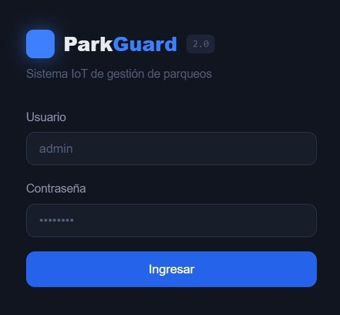
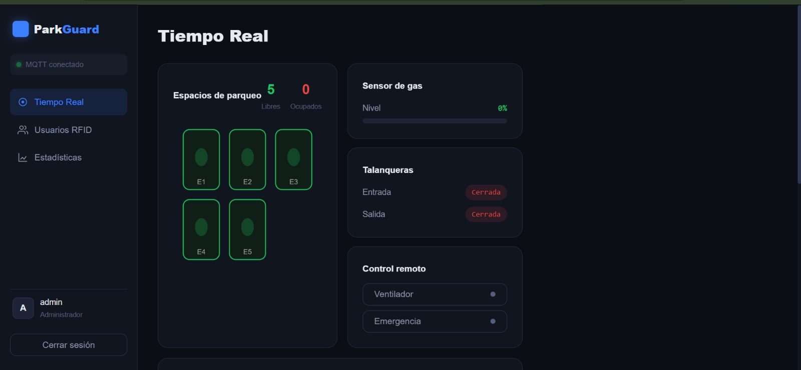
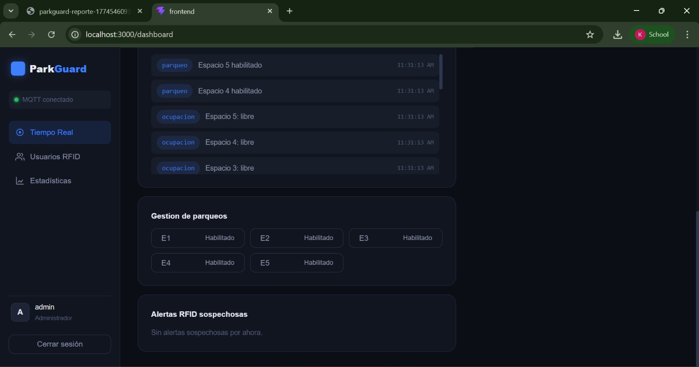
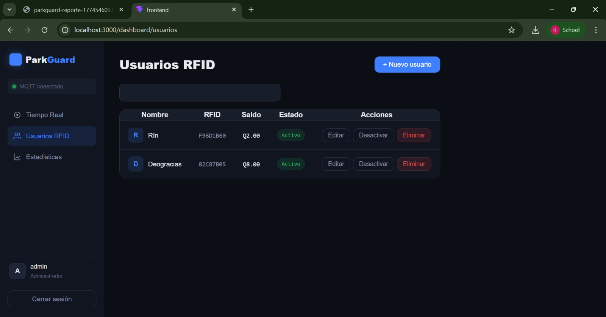
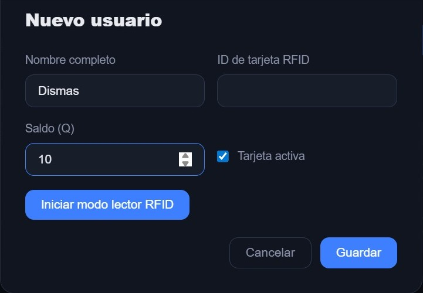
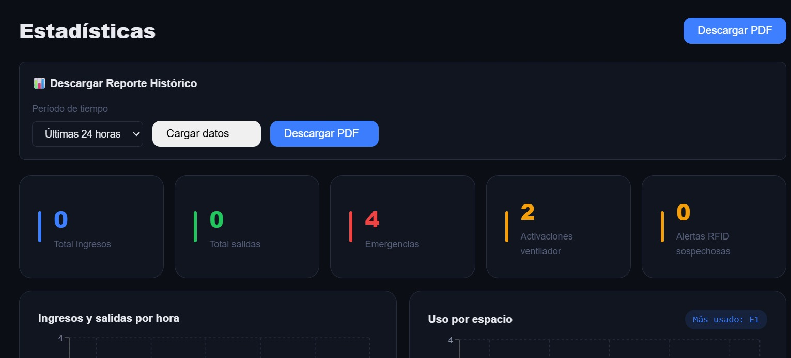
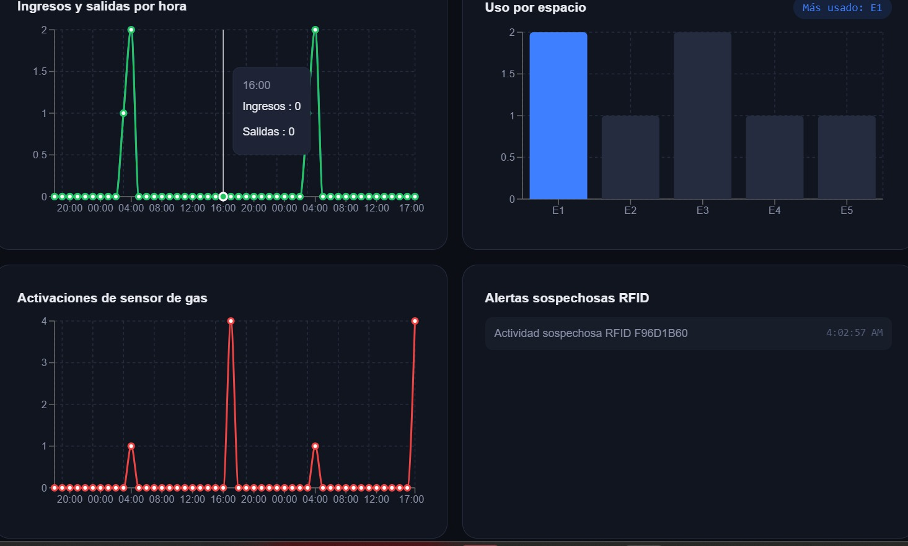
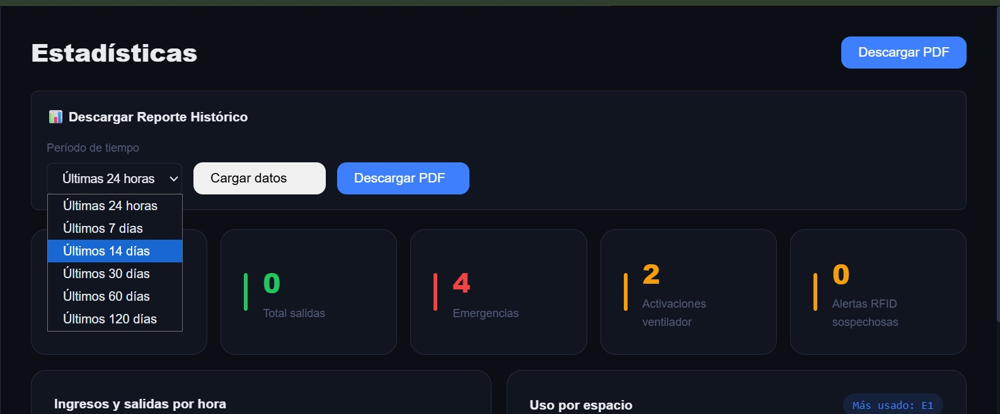

## Universidad de San Carlos de Guatemala
## Facultad de ingeniería
## Laboratorio Arquitectura de Computadores y Ensambladores 2
## Sección A
## Auxiliar: Samuel Isaí Muñoz Pereira

### PROYECTO # 2

### Park-Guard 2.0
### Manual de Usuario

### Integrantes del Grupo
| Nombre | Carnet |
|---|---|
| Kevin David Tobar Barrientos | 202200236 |
| Jacklyn Akasha Cifuentes Ruiz  | 202201432 |
| Daved Abshalon Ejcalon Chonay | 202105668 |
| Isaac Mahanaim Loarca Bautista | 202307546 |
| Raúl Emanuel Yat Cancinos | 202300722 |

## Introducción
Park-Guard 2.0 es un sistema inteligente de gestión de parqueos desarrollado como parte del curso de Arquitectura de Computadoras y Ensambladores 2. Representa la evolución de un sistema automatizado local hacia una plataforma IoT (Internet de las Cosas) distribuida, que permite la supervisión remota, el control en tiempo real y el análisis histórico de la operación de un parqueo vehicular.

El sistema integra una maqueta física que simula un parqueo con sensores de ocupación, control de acceso mediante tecnología RFID, detección de gases peligrosos y actuadores como talanqueras, ventilador y alarma sonora. Toda esta información es transmitida a través de un broker MQTT hacia una infraestructura backend que procesa, almacena y visualiza los datos en una interfaz web moderna.

El presente manual está dirigido a los operadores, administradores y usuarios finales del sistema, brindando las instrucciones necesarias para acceder a la plataforma, gestionar usuarios, monitorear el estado del parqueo en tiempo real, generar reportes estadísticos y ejecutar acciones remotas sobre los dispositivos físicos.

### Propósito del Manual
El propósito de este manual es proporcionar una guía clara y detallada para el uso del sistema Park-Guard 2.0, permitiendo a los usuarios comprender el funcionamiento de cada módulo y aprovechar al máximo las capacidades de la plataforma. Donde los objetivos de este manual son:

- Describir el proceso de acceso y autenticación en el sistema.

- Explicar el uso de los diferentes dashboards (visualización en tiempo real, gestión de usuarios, estadísticas).

- Detallar cómo gestionar tarjetas RFID, incluyendo registro, edición, activación y desactivación.

- Guiar en la ejecución de acciones remotas como activación de ventilador, emergencia y habilitación/deshabilitación de espacios.

- Proporcionar una sección de solución de problemas comunes para facilitar la resolución de incidentes.

## Requisitos del Sistema

Para el correcto funcionamiento del sistema Park-Guard 2.0, es necesario cumplir con los siguientes requisitos técnicos:

### Requisitos de Hardware (para el usuario del frontend web)

| Componente | Requisito Mínimo |
|------------|------------------|
| **Procesador** | Intel Core i3 o equivalente |
| **Memoria RAM** | 4 GB |
| **Almacenamiento** | 500 MB disponibles |
| **Conexión a Internet** | Red local (LAN) o WiFi, con acceso al servidor donde se ejecuta el sistema |
| **Dispositivo** | Computadora de escritorio, laptop o tablet con navegador web moderno |

### Requisitos de Software

| Componente | Requisito |
|------------|-----------|
| **Sistema Operativo** | Windows 10/11, macOS, Linux (distribuciones recientes) |
| **Navegador Web** | Google Chrome (versión 90 o superior) / Mozilla Firefox (versión 88 o superior) / Microsoft Edge (versión 90 o superior) / Safari (versión 14 o superior) |
| **JavaScript** | Habilitado (requerido para el funcionamiento de P5.js y las actualizaciones en tiempo real) |
| **WebSockets** | Soportado por el navegador (para comunicación en tiempo real con el broker MQTT) |

### Requisitos de Infraestructura (para el despliegue)

| Componente | Descripción |
|------------|-------------|
| **Docker** | Versión 20.10 o superior (para ejecutar los contenedores) |
| **Docker Compose** | Versión 2.0 o superior (para orquestar los servicios) |
| **Puertos de red** | 1883 (MQTT), 9001 (MQTT WebSockets), 8000 (API), 3000 (Frontend), 27017 (MongoDB) disponibles |
| **Red** | Todos los servicios deben estar en la misma red interna (configuración automática con docker-compose) |

### Acceso a Internet

- Para la descarga de imágenes desde Docker Hub en la fase de despliegue.
- Para la visualización de la interfaz web desde equipos clientes en la misma red.

## Guía
Primero que todo, debemos de tener lista la maqueta donde todos sus componentes deben de estar en funcionamiento y con energí eléctrica. Para ello también se precisa que la Raspberry esté conectada a la computadora respectiva donde va a funcionar todo.

Luego debe de entrar al frontend donde se mostrará el siguiente Login, para ello debe de ingresar sus datos para iniciar sesión

Al entrar al inicio va a poder observar el Dashboard donde están los espacios de los parqueos disponibles y ocupados, el porcentaje del sensor de gas, las talanqueras y el control remoto que valga la redundancia controla el ventilador y la emergencia

También podrá observar la gestión de parqueos y las alertas RFID sospechosas

Al lado izquierdo hay un panel donde al seleccionar "Usuarios RFID", donde podrá ver los usuarios que están en la base de datos

En esta parte también puede agregar usuarios mediante esta nueva ventana que se abre

Cuando se selecciona la opción de Estadísticas del panel podrá observar las diversas gráficas acerca del Reporte Histórico, total de ingresos, total de salidas, emergencias, activaciones del ventilador, alertas RFID sospechosas, entre otras

Usted podrá seleccionar el tiempo de los datos ya sea hace 120 días o hace 24 horas
